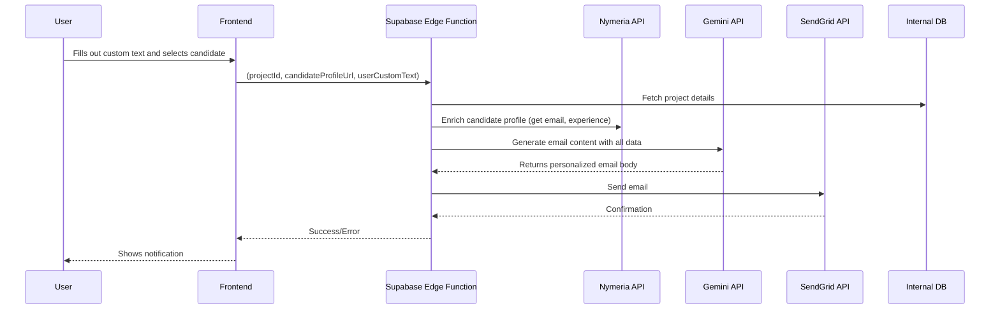

# Gemini-Powered Email Outreach Feature

## 1. Overview

This document outlines a new feature to send personalized outreach emails to candidates. The system will leverage Gemini to generate dynamic email content based on project details, user input, and candidate information sourced from Nymeria. Emails will be sent via SendGrid.

## 2. Core Functionality

- **Personalized Email Generation**: Use Gemini to craft unique emails for each candidate.
- **Dynamic Content**: Emails will incorporate:
    - Details from the specific project/job.
    - Custom text provided by the user.
    - Candidate's professional information (from LinkedIn via Nymeria).
- **Automated Sending**: Emails are sent through SendGrid.
- **Sender Identity**: Initially, all emails will be sent from `hello@hiapply.co`. Future iterations will allow users to send from their own connected accounts.

## 3. System Architecture & Data Flow

The process will be orchestrated by a new Supabase Edge Function.

## 4. New Supabase Edge Function: `send-outreach-email`

This function will be the core of the new feature.

### Inputs:
- `projectId`: The ID of the project/job.
- `candidateProfileUrl`: The LinkedIn profile URL of the candidate.
- `userCustomText`: A short text snippet from the user to be included in the email.

### Process:
1.  **Fetch Project Details**: Retrieve job title, company, and key requirements from the database using `projectId`.
2.  **Enrich Candidate Profile**: Call the existing `enrich-profile` logic (which uses Nymeria) with `candidateProfileUrl` to get the candidate's work history, skills, and, most importantly, their email address.
3.  **Construct Gemini Prompt**: Create a detailed prompt for Gemini, including:
    - **Role**: "You are a friendly and professional recruiter."
    - **Goal**: "Write a concise, engaging, and personalized outreach email to a potential candidate."
    - **Context**:
        - **Project Details**: Job Title, Company, Key Responsibilities.
        - **Candidate Details**: Name, Current Role, Experience Summary.
        - **User's Custom Input**: A specific point or question the user wants to include.
    - **Constraints**:
        - Keep the email under 200 words.
        - Maintain a professional yet approachable tone.
        - End with a clear call to action (e.g., "Are you available for a brief chat next week?").
4.  **Generate Email Content**: Call the Gemini API to get the email subject and body.
5.  **Send Email**: Use the SendGrid API to send the generated email to the candidate's email address.
    - **From**: `hello@hiapply.co`
    - **To**: Candidate's email from Nymeria.
    - **Subject/Body**: From Gemini.

## 5. UI/UX Considerations

- A new component will be added to the candidate profile view.
- This component will feature a simple form with:
    - A text area for the `userCustomText`.
    - A "Send Email" button.
- The UI should provide feedback on the status of the email (sending, sent, failed).

## 6. Future Enhancements

- **User-Branded Emails**: Allow users to connect their own email accounts (e.g., via OAuth with Google) to send emails from their own address. This will require SendGrid configuration to allow for "send on behalf of" functionality.
- **Template Management**: Allow users to save and reuse successful email templates.
- **A/B Testing**: Implement A/B testing for email subjects and content to optimize response rates.
- **Follow-up Sequences**: Create automated multi-step email sequences for candidates who don't respond.
